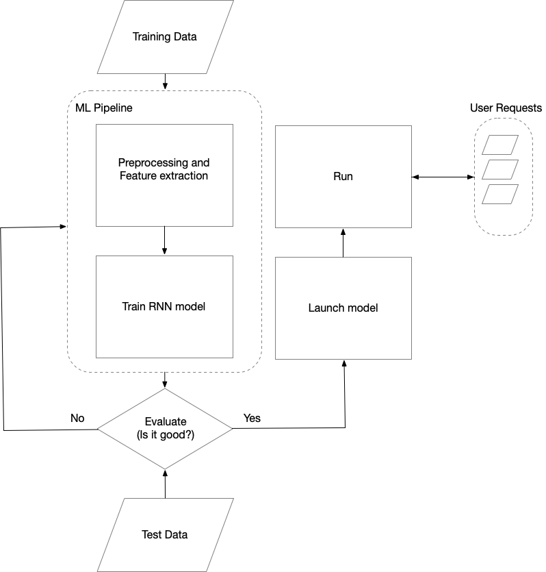

# Rate of speech (ROS)

In the following sections is a description of a system to predict a person's rate of speech.

A machine learning algorithm powers the pipeline; therefore, it requires a
stages for training, evaluation, and launching the model.

## Overview of the system

The overview of the system in the diagram below shows different components and their
relations.

For this system, we need to prepare data to train ML models.
Speech data must be labeled with the ROS information.
The ROS can be provided by small windows of ten seconds.

Then ML pipeline is trained with the labeled data. If the result is good
enough on the test data, the model is launched to the production. 

The users can make requests to the system with the speech data and get back the
ROS.

## Machine learning pipeline

The machine learning pipeline consists of a preprocessing stage that converts
the voice to the feature vectors and RNN network.
The RNN network is used to solve the regression problem, which is predicting a
single value. 
Therefore the last layer is a dense layer with one output. 
Since the ROS is a positive number we can use Relu activation function to
constrain the output to the positive numbers.

## Preprocessing

Preprocessing component converts the voice waves to the feature vectors for the
system.

The voice data contains depending on the sampling rate contains a lot of data. 
If we have a voice that is sampled at $8KHZ$, for a one minute voice it has $60
\times 8000 = 48000$ values.
Therefore the data is partitioned in chuncks. 
For instance we can take each $100 ms$ as a window with $800$ value and give it to the system.

Next, the Fourier tansform is used to provide the frequency and energy of the wave.
The output of Preprocessing part will be a sequence of feature that are
extracted from each voice window. 

